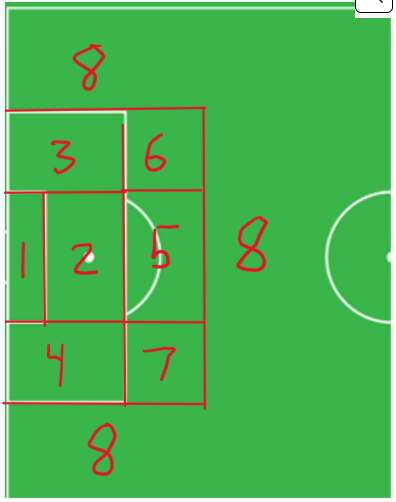
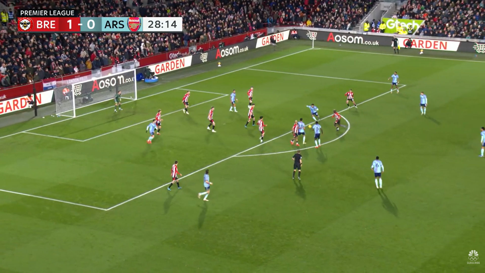
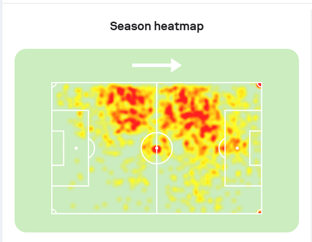
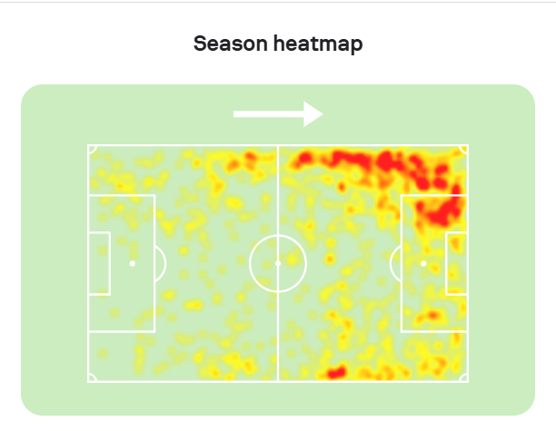
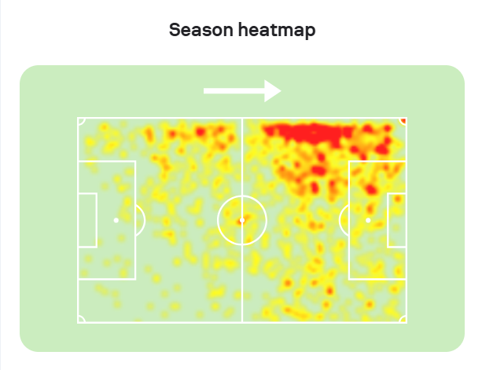

```{r setup}
library(tidyverse)
source("arsenal_analysis_functions.R")

arsenal_24_25 <- load_and_clean_arsenal_data("arsenal_24_25.csv")
```

# Introduction

Going into the 2024/25 season, Arsenal were meant to be the favorites to win the Premier League after finishing 2nd in back-to-back seasons. But ultimately, despite a deep run in the Champions League, their inconsistency in the Premier League was a shock to many. Specifically, despite their defense still being solid, their attacking numbers declined way more from the 2023/24 season prior.

In this report, using a dataframe of almost all the shots Arsenal took in the 2024/25 Premier League season, I will highlight their strengths and weaknesses from the season and what the team can change before the next season starts.

# Arsenal's Shooting Profile

## Overall Summary

```{r general-summary}
table_general_summary(arsenal_24_25)
```

## Shot Outcomes

```{r shot-results}
table_shot_results(arsenal_24_25)
```

## Leading Shooters

```{r frequent-shooters}
table_frequent_shooters(arsenal_24_25)
```

## Assist Types

```{r assist-types}
table_common_assist_types(arsenal_24_25)
```

## Shot Zones

```{r shot-zones-table}
table_common_shot_zones(arsenal_24_25)
```

{width="30%"}

From the diagram and information above, we can tell that a majority of Arsenal's shots are central and inside the box. Out of 291 shots from open play, Arsenal scored 63, which is an 18% conversion rate.

# How Opponents Defended Arsenal

The narrative around Arsenal being favorites may have caused other teams' defensive styles of play against them to change.

## Defensive Line

```{r defensive-line}
table_defensive_line(arsenal_24_25)
```

## Defensive Traffic

```{r defensive-traffic}
plot_defensive_box_traffic(arsenal_24_25)
```

Now that Arsenal are favorites, Premier League teams "respect" them more, meaning they give Arsenal more space to play out the back and advance towards the opposing teams' box. This usually means they sit deeper and give Arsenal more space in their own defensive third, allowing them to build out from the back with relative ease.

However, as soon as Arsenal approaches the final third, all that space disappears. Opponents put more defenders between the ball and the goal, making it harder for Arsenal to pass and create more threatening shots.

As seen from the histogram, teams mostly have at least 5 players excluding the goalkeeper defending the goal in their own box whenever Arsenal take a shot.

{width="70%"}

As one can see in the photo above from Arsenal vs Brentford in January, Brentford had all their players behind the ball. This made it very difficult for Arsenal to create a shot that was very likely to score.

## Pressure and Shot Quality

As a result, teams often get pressure on the player shooting.

```{r pressure-test}
table_pressure_xg_difference(arsenal_24_25)
```

Shots taken under defensive pressure had an average xG of 0.14, while shots without pressure had an average xG of 0.24. This difference is large enough that it is very unlikely to be due to chance, showing that pressure greatly reduces the quality of Arsenal's chances.

# Arsenal's Chance Creation

To find what areas Arsenal attack in better than others in possession, I divided the area into 5 spaces: the left halfspace, right halfspace, middle, left, and right. I also looked at shots from set pieces, which are restarts that the referee awards, such as corner kicks and free kicks.

## Final-Third Entries

```{r attack-entries}
table_attack_entries(arsenal_24_25)
```

From the table, we see that Arsenal are mostly reliant on attacking from the wings and right halfspace, with less emphasis on the left halfspace and middle. This makes sense because players such as Saka, Odegaard, Martinelli, and Trossard often take up these spaces.

## Set-Piece Reliance

This season, Arsenal were also known to heavily rely on set pieces in tight games.

```{r set-pieces}
table_set_piece_goal_percentage(arsenal_24_25)
```

In fact, 22.2% of Arsenal's goals were from set pieces. As a team that is supposed to dominate games, this is concerning because it highlights how uninspired Arsenal's creation was from open play relative to prior seasons.

# Individual Shot Creation and Dribbling

From a fan's perspective, a lot of Arsenal's lack of creation stems from the fact that they do not have enough world-class playmakers. Many players depend on the system rather than creating big chances by themselves. To gain insight into this, I checked how often players dribble before shots.

## Touches Before Shot

```{r touches-before-shot}
plot_touches_before_shot(arsenal_24_25)
```

For starters, the majority of Arsenal's shots were first-time shots, meaning players either did not touch the ball before shooting or only took one touch to control it. This suggests that Arsenal players rarely created shots for themselves. They had to rely on movement and passing to score.

## Defender-Beating Actions

```{r defender-beating-summary}
table_defender_beating_summary(arsenal_24_25)
```

About 22% of Arsenal's goals and shots came after an Arsenal player beat a defender on the dribble. For Arsenal to succeed offensively and score more goals, this number should go up next season.

```{r best-dribblers}
table_defender_beating_players(arsenal_24_25)
```

From the table, we see that Bukayo Saka beat the most players one-on-one despite missing half the season through injury. Despite that injury, he still had more defender-beating actions than Gabriel Martinelli and Leandro Trossard. This supports the idea that Arsenal's attack depends heavily on Saka.

## Left Side vs. Right Side

```{r wing-entry-xg}
plot_xg_by_wing_entry(arsenal_24_25)
```

I observed that the right side tends to produce higher upper-end xG chances, though this difference was not statistically significant. This may suggest potential but inconsistent quality from the right.

## Dribbling Impact by Zone

```{r beating-defender-zone-test}
table_beating_defender_xg_by_zone(arsenal_24_25)
```

To evaluate whether Arsenal creates more dangerous chances when attackers beat defenders on the dribble, I compared xG in situations where a defender was beaten versus when they were not. In zone 1, the p-value is almost significant. In the small sample size, when Arsenal players beat their defender and pass into the box, it is often very dangerous.

[Arsenal vs Ipswich GW18 — Saka dribble in zone 1](https://youtu.be/62DBSHviDYY?si=A_4GZ9vwrz50L_ms&t=88)

# Transition Attacking

With Arsenal struggling to score against low blocks, the ability to capitalize on transition goals is important.

```{r transition-summary}
table_transition_shots(arsenal_24_25)
```

Some fans believe Arsenal were too slow in transition compared to seasons prior. The average xG from transitions is higher than the total average, but the time to shoot is pretty long, which makes it easier for defenders to get back and protect their goal. Overall, Arsenal's transition play lacked creativity, decision making, and efficiency.

[Arsenal transition example — Martinelli GW decision making](https://youtu.be/siDxiv91yTI?si=EMSB9jd4TNkVSauI)

As seen in the clip, Martinelli makes a poor decision to shoot while the defender is recovering to block the goal. He also does not have strong passing options for a better shot. This was a common theme throughout the season.

# Transfer Recommendation: Eberechi Eze

After this season, many fans believed the main target should be a left winger. After playing around with the data, I believe the data supports this. Not everything was statistically significant, but football is a game of small margins.

The player Arsenal have been linked with is Eberechi Eze. Eze is a talented playmaker, dribbler, and finisher. The main concern is that he is primarily a central attacking midfielder and not a traditional touchline winger.

## Current Left-Wing Shot Zones

```{r left-wing-shot-zones}
table_player_shots_by_zone(arsenal_24_25, "Leandro Trossard")
table_player_shots_by_zone(arsenal_24_25, "Gabriel Martinelli")
```

## Player Heatmaps

{width="70%"}

{width="70%"}

{width="70%"}

From the heatmaps, we can see that all three players have a lot of touches on the touchline. Although Eze operated more frequently in the middle of the field, he has enough experience in wide areas to be useful for Arsenal on the left.

## Eze Shot Map

{width="70%"}

Knowing Eze as a player and seeing both his heatmap and shotmap, I would say that he "generates football." What that means is that no matter where he plays, he usually finds a way to make an impact. He can shoot, dribble, and pass in the middle and left part of the field.

[Eze left-side cross](https://youtu.be/ocwPznvEyqk?si=akr-F37EoKj9Nomt&t=423)

[Eze driving inside and creating space](https://youtu.be/ocwPznvEyqk?si=ZGSb3zYD68OXvGRn&t=510)

Outside of the numbers and maps, these clips show Eze's ability to play on the left. In the first clip, he plays a strong cross from the touchline. In the second clip, he receives the ball on the left, drives inside, attracts defenders, and opens space for a teammate.

This type of player would help lighten the load on Saka and make Arsenal's attack less predictable.

# Conclusion

Arsenal remained strong defensively during the 2024/25 season, but their attack became too predictable. Opponents defended deeper, Arsenal relied heavily on set pieces, and Bukayo Saka carried too much of the team's individual creation. While some results were limited by sample size, the overall patterns suggest Arsenal would benefit from adding another creative dribbler on the left side. Based on the data and tactical evidence, Eberechi Eze appears to be a strong fit for that need.